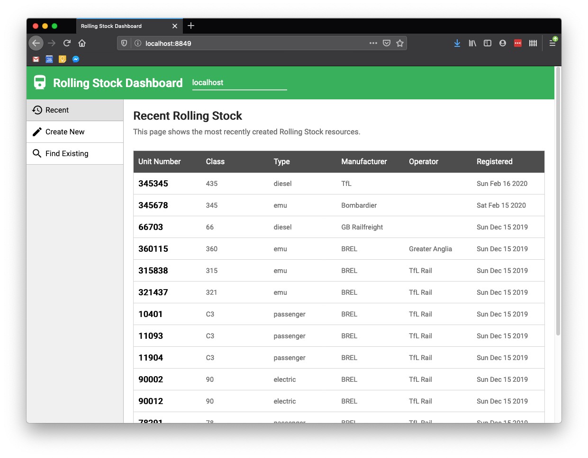

# railway-stock-api

Full-stack demo project modelling management of railway stock inventory.

## `service`

Express server exposing a CRUD API with schema-validated endpoints storing in
MongoDB.

* `POST /railwayStock` - Create a railway stock item.

* `GET /railwayStock` - Retrieve a list of the most recently created items.

* `GET /railwayStock?q=...` - Retrieve a filtered list of recently created
  items.

* `GET /railwayStock/:railwayStockId` - Retrieve an item by `id`.

* `PUT /railwayStock/:railwayStockId` - Replace an item by `id`.

* `DELETE /railwayStock/:railwayStockId` - Delete an item by `id`.

## `dashboard`

React dashboard application built with Webpack to allow human management of
database entries.

* Create a railway stock item.

* View a table of recently created items.

* Search for items by unit number, class, type, or manufacturer.

* Update an existing item.

* Delete an existing item.

## `openapi`

OpenAPI spec components describing the API.

## `database`

Scripts and tools for MongoDB database.

* `start-mongo.sh` - Start mongod locally.

* `insert-example-data.sh` - Use `curl` to insert some example data via the API.
